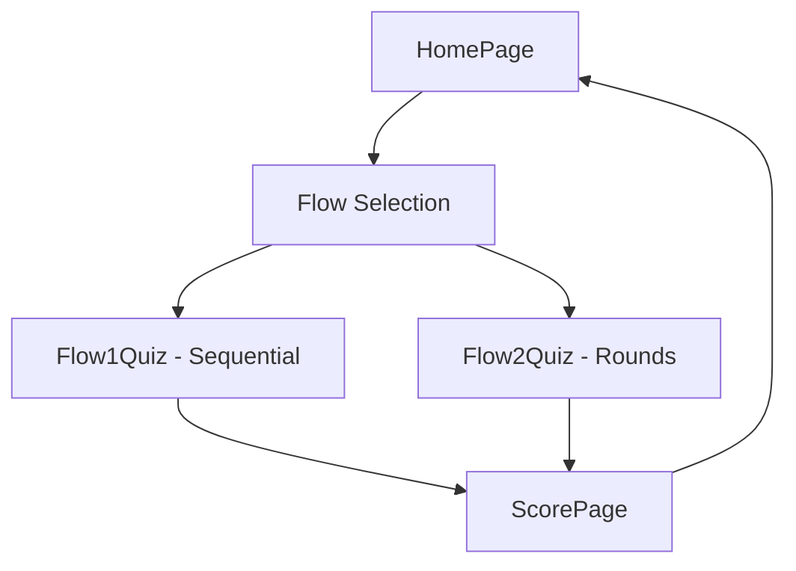

# Error Find Quiz Application

A modern React TypeScript application demonstrating error detection in written text through an interactive quiz interface.

## 🌐 Live Application

**Try the app online**: [https://quiz-app-98108.web.app](https://quiz-app-98108.web.app)

The application is fully deployed and functional with both quiz flows available for testing.

## 🎯 Overview

This application implements two distinct quiz flows for identifying grammatical errors in text:

- **Flow 1**: Sequential questions (5 total) with progress tracking and score screen
- **Flow 2**: Rounds-based questions where users must pass each round to proceed

## 🏆 Score Calculation System

The application features a robust, centralized score calculation system that handles both quiz flows consistently:

### Key Features

- **Centralized Logic**: Uses `QuizEngine` service for consistent scoring across both flows
- **Flow-Specific Handling**: Automatically handles different data structures for Flow1 and Flow2
- **Unique Identifiers**: Prevents conflicts in Flow2 where questions across rounds may have duplicate order values
- **Real-time Validation**: Compares user answers with correct answers extracted from question feedback
- **Comprehensive Debugging**: Includes detailed logging for troubleshooting and verification

### How It Works

1. **Answer Extraction**: Correct answers are extracted from `question.feedback` (with asterisks removed)
2. **User Answer Matching**: Direct text comparison between user selection and correct answer
3. **Flow-Specific Processing**:
   - **Flow1**: Uses simple question order keys (`"1"`, `"2"`, `"3"`)
   - **Flow2**: Uses unique identifiers (`"0-1"`, `"1-2"`, `"2-1"`) to handle duplicate question orders
4. **Score Calculation**: Returns `{ correct, total, percentage }` for display

### Technical Implementation

```typescript
// Centralized score calculation
const score = QuizEngine.calculateScore(userAnswers, questions);

// Flow-specific handling in context
if (flow === "flow1") {
  questions = quizData.activities[0]?.questions || [];
} else {
  // Flow2: Generate unique identifiers
  questions = [];
  quizData.activities[1]?.questions?.forEach((round, roundIndex) => {
    round.questions.forEach((question) => {
      questions.push({
        ...question,
        uniqueId: `${roundIndex}-${question.order}`,
      });
    });
  });
}
```

## 📋 Original Project Brief

### The Task

Build and deploy a simple TypeScript React web app which implements 2 flows of a simple quiz application.

### Application Structure

The application has 3 main parts/screens:

1. **Home Screen**: Contains 2 buttons, each starting one of the flows
2. **Question Screens**: Display quiz multiple choice questions for each flow
3. **Score Screen**: Displays the score to the user with a button to return to home

### The Two Flows

**Flow 1 (Sequential)**:

- Iterates through all questions
- When all questions are answered, displays the score screen

**Flow 2 (Rounds-based)**:

- Iterates through multiple sets of questions (rounds)
- After each set, prompts user to "take the next round"
- When all rounds are completed, shows the score screen

### Data Source

- Quiz questions and answers come from API: `https://s3.eu-west-2.amazonaws.com/interview.mock.data/payload.json`
- Two types of questions with different structures
- Must inspect API structure and implement accordingly

### Requirements Checklist ✅

- [x] **Built with React using TypeScript**
- [x] **Pulls from the API** - Successfully integrated with mock API
- [x] **App looks presentable** - Clean, modern UI with responsive design
- [x] **App deployed** - Live at https://quiz-app-98108.web.app
- [x] **Architectural decisions** - Well-structured, reusable code
- [x] **Documentation** - Comprehensive README and docs
- [x] **Reusable code** - Organized components and utilities

## 🚀 Features

- **Modern React Architecture**: Built with React 18, TypeScript, and modern patterns
- **TanStack Query**: Advanced data fetching with caching and background updates
- **Suspense Integration**: Declarative loading states with error boundaries
- **Responsive Design**: Mobile-first approach with clean, accessible UI
- **Firebase Hosting**: Deployed with global CDN and automatic HTTPS
- **Error Detection**: Interactive text analysis with immediate feedback (no hints provided)
- **Progress Tracking**: Visual progress bars for both quiz flows
- **Score Calculation**: Comprehensive scoring system with percentage results
- **Smart Answer Generation**: Contextually relevant incorrect options
- **Unique Answer Keys**: Prevents answer collision between rounds

## 🛠 Tech Stack

### Core Technologies

- **React 18+** - Modern React with concurrent features
- **TypeScript** - Type-safe development
- **Vite** - Fast build tool and dev server
- **TanStack Query v5** - Server state management
- **React Router v6** - Client-side routing
- **Firebase Hosting** - Deployment and hosting

### Development Tools

- **ESLint** - Code linting
- **Prettier** - Code formatting
- **React Error Boundary** - Error handling
- **SCSS** - Enhanced CSS with variables and mixins
- **CSS Modules** - Scoped styling

## 📁 Project Structure

```
src/
├── components/           # Reusable UI components
│   ├── common/          # Shared components (Button, Loading, etc.)
│   │   ├── Button.tsx           # Reusable button component
│   │   ├── LoadingSpinner.tsx   # Loading indicators
│   │   └── ProgressBar.tsx      # Progress visualization
│   ├── quiz/            # Quiz-specific components
│   │   ├── QuestionCard.tsx     # Main question display
│   │   ├── AnswerOptions.tsx    # Multiple choice options
│   │   ├── QuizResult.tsx       # Answer feedback display
│   │   └── QuizProgress.tsx     # Progress tracking
│   └── layout/          # Layout components
│       └── Layout.tsx           # Main app layout wrapper
├── hooks/               # Custom React hooks
│   ├── useAnswerOptions.ts      # Generates answer choices
│   ├── useQuizLogic.ts          # Core quiz state management
│   └── useFlow2Logic.ts         # Flow 2 specific logic
├── services/            # API and external services
│   ├── quizApiService.ts        # API data fetching
│   ├── quizEngine.ts            # Core quiz logic & scoring
│   └── queryClient.ts           # TanStack Query configuration
├── types/               # TypeScript type definitions
│   └── quiz.ts                  # Quiz-related type definitions
├── utils/               # Utility functions
│   └── textParser.ts            # Text parsing helpers
├── contexts/            # React contexts for state management
│   └── QuizContext.tsx          # Global quiz state
├── pages/               # Main application screens
│   ├── HomePage.tsx             # Landing page with flow selection
│   ├── Flow1Quiz.tsx            # Sequential quiz flow
│   ├── Flow2Quiz.tsx            # Rounds-based quiz flow
│   └── ScorePage.tsx            # Final results display
└── styles/              # CSS/styling files
    ├── globals.scss             # Global styles
    ├── variables.scss           # SCSS variables
    └── mixins.scss              # Reusable SCSS mixins
```

## 🚀 Quick Start

### Prerequisites

- Node.js 18+
- npm or yarn
- Firebase CLI (for deployment)

### Installation

```bash
# Clone the repository
git clone <repository-url>
cd error-find-quiz

# Install dependencies
npm install

# Start development server
npm run dev
```

### Available Scripts

```bash
# Development
npm run dev          # Start development server
npm run build        # Build for production
npm run preview      # Preview production build

# Code Quality
npm run lint         # Run ESLint
npm run type-check   # Run TypeScript compiler

# Deployment
npm run deploy       # Build and deploy to Firebase
```

## 🎮 User Flow & Usage

### Intended User Journey (Based on Brief)

#### 1. Home Screen Entry Point

- User lands on home page with 2 clear buttons
- **"Start Flow 1"** - Sequential quiz flow
- **"Start Flow 2"** - Rounds-based quiz flow

#### 2. Flow 1: Sequential Questions Journey

1. **Start**: Click "Start Flow 1" button
2. **Question Loop**: Answer all 5 questions in sequence
   - Progress bar shows "Question X of 5"
   - Multiple choice options for each question
   - Immediate feedback after each answer
3. **Completion**: After all questions answered → Score screen
4. **Return**: Score screen has button to return to home

#### 3. Flow 2: Rounds-based Questions Journey

1. **Start**: Click "Start Flow 2" button
2. **Round Loop**: Complete each round sequentially
   - Round progress shows "Round X of Y"
   - Must answer correctly to proceed to next round
   - "Take the next round" prompt between rounds
3. **Completion**: After all rounds completed → Score screen
4. **Return**: Score screen has button to return to home

### Question Format & Interaction

- **Text Analysis**: Read text and identify grammatical errors
- **Multiple Choice**: Select correct version from 4 options
- **Immediate Feedback**: See correct/incorrect status instantly
- **Progress Tracking**: Visual progress indicators throughout

### Design Decisions vs Wireframes

**Our Implementation Enhancements**:

- ✅ **Enhanced UI**: Modern, clean design with better UX than basic wireframes
- ✅ **Progress Indicators**: Visual progress bars for both flows
- ✅ **Intelligent Answer Generation**: Context-aware incorrect options
- ✅ **Error Highlighting**: Visual error highlighting in text
- ✅ **Responsive Design**: Mobile-first approach not shown in wireframes
- ✅ **Loading States**: Proper loading and error handling
- ✅ **Score Details**: Comprehensive score display with percentages

**Core Requirements Met**:

- ✅ Home screen with 2 buttons (as specified)
- ✅ Question screens for each flow (as specified)
- ✅ Score screen with return button (as specified)
- ✅ API integration (as specified)
- ✅ Two distinct flows (as specified)

## 🔧 API Integration

The application fetches quiz data from:

```
https://s3.eu-west-2.amazonaws.com/interview.mock.data/payload.json
```

### Data Structure

- **Flow 1**: `activities[0].questions` - Sequential questions
- **Flow 2**: `activities[1].questions[round].questions` - Rounds-based questions

### Error Handling

- Automatic retry logic for failed requests
- Graceful fallback UI for network errors
- Loading states with skeleton screens

## 🎯 Answer Generation System

The application intelligently creates multiple choice options by parsing the JSON data from the [API endpoint](https://s3.eu-west-2.amazonaws.com/interview.mock.data/payload.json). Here's how it works:

### Core Data Fields

Each question in the JSON contains:

- **`stimulus`**: The sentence with the error (marked with asterisks)
- **`feedback`**: The corrected sentence (marked with asterisks)
- **`is_correct`**: Whether the original stimulus is correct or not

### Example from API Data

```json
{
  "stimulus": "I really enjoy *to play football* with friends.",
  "feedback": "I really enjoy *playing football* with friends.",
  "is_correct": false
}
```

### Answer Option Generation Process

The `QuizEngine.generateAnswerOptions()` method creates 4 answer choices:

#### 1. Extract Correct Answer

```typescript
// Remove asterisks from feedback to get the correct answer
const correctAnswer = question.feedback.replace(/\*([^*]+)\*/g, "$1");
// Result: "I really enjoy playing football with friends."
```

#### 2. Extract Incorrect Answer

```typescript
// Remove asterisks from stimulus to get the incorrect answer
const incorrectAnswer = question.stimulus.replace(/\*([^*]+)\*/g, "$1");
// Result: "I really enjoy to play football with friends."
```

#### 3. Generate Intelligent Alternatives

The system analyzes the question pattern and generates contextually relevant alternatives:

**Pattern Recognition Examples:**

- **"haven't finished"** → `["didn't finish", "hasn't finished", "won't finish"]`
- **"like listening"** → `["likes to listen", "like to listen", "likes listening"]`
- **"more cheaper"** → `["more cheap", "cheaper", "most cheap"]`
- **"In the other hand"** → `["On the other hand", "In other hand", "On other hand"]`
- **Default patterns** → `["playing", "to play", "play"]`

#### 4. Final Answer Options

The system creates 4 options total:

1. **Correct answer** (from feedback)
2. **Incorrect answer** (from stimulus)
3. **Two intelligent alternatives** (contextually relevant)
4. **Randomized order** to prevent easy guessing

### Complete Example

**Input JSON:**

```json
{
  "stimulus": "Watching films at home is *more cheaper* than at the cinema.",
  "feedback": "Watching films at home is *cheaper* than at the cinema."
}
```

**Generated Answer Options:**

```typescript
[
  {
    value: "Watching films at home is cheaper than at the cinema.",
    isCorrect: true,
  },
  {
    value: "Watching films at home is more cheaper than at the cinema.",
    isCorrect: false,
  },
  {
    value: "Watching films at home is more cheap than at the cinema.",
    isCorrect: false,
  },
  {
    value: "Watching films at home is most cheap than at the cinema.",
    isCorrect: false,
  },
];
```

### Technical Implementation

The answer generation is handled by:

- **`QuizEngine.generateAnswerOptions()`** - Main generation logic
- **`useAnswerOptions()` hook** - React hook for memoized options
- **`textParser.ts`** - Utility functions for text manipulation
- **Pattern-based alternatives** - Context-aware incorrect options

This system ensures that:

- ✅ Users see realistic alternatives (not random text)
- ✅ Options are grammatically related to the question
- ✅ The correct answer is always present
- ✅ Options are randomized to prevent pattern recognition
- ✅ Each question gets exactly 4 choices

## 🎨 Styling

### CSS Architecture

- **SCSS**: Enhanced CSS with variables, mixins, and nesting
- **CSS Modules**: Scoped component styles
- **Design System**: Consistent theming and spacing
- **Mobile-first**: Responsive design approach
- **Accessibility**: WCAG compliance considerations

### Design System

```scss
// SCSS Variables
$primary-color: #007bff;
$success-color: #28a745;
$danger-color: #dc3545;
$font-family-base:
  -apple-system, BlinkMacSystemFont, "Segoe UI", Roboto, sans-serif;
$spacing-md: 1rem;
$border-radius: 4px;

// Responsive Breakpoints
$breakpoint-sm: 576px;
$breakpoint-md: 768px;
$breakpoint-lg: 992px;
```

## 🚀 Deployment

### Firebase Hosting Setup

```bash
# Install Firebase CLI
npm install -g firebase-tools

# Login to Firebase
firebase login

# Initialize Firebase project
firebase init hosting

# Deploy
npm run deploy
```

### Environment Configuration

- **Development**: Local development with hot reload
- **Production**: Optimized build with Firebase hosting
- **Preview**: Branch-based preview deployments

## 📊 Performance

### Optimization Features

- **Code Splitting**: Route-based lazy loading
- **Bundle Optimization**: Manual chunk splitting
- **Caching**: TanStack Query automatic caching
- **CDN**: Firebase global content delivery

### Performance Metrics

- **First Contentful Paint**: < 1.5s
- **Largest Contentful Paint**: < 2.5s
- **Cumulative Layout Shift**: < 0.1
- **First Input Delay**: < 100ms

## 🔒 Security

### Security Features

- **HTTPS Enforcement**: Automatic SSL certificates
- **Content Security Policy**: XSS protection
- **Input Sanitization**: Safe user input handling
- **Security Headers**: Comprehensive security headers

## 📚 Documentation

### Architecture Documentation

- [Project Brief & Requirements](docs/project-brief.mdc) - Original brief, requirements checklist, and implementation analysis
- [Architecture Overview](docs/architecture.mdc) - Complete app architecture and flow implementation details
- [Tech Stack Details](docs/tech-stack.mdc) - Technology choices, rationale, and implementation patterns
- [API Integration](docs/api-integration.mdc) - API integration, data flow, and error handling
- [Component Documentation](docs/components.mdc) - Component architecture, patterns, and implementation
- [Deployment Guide](docs/deployment.mdc) - Firebase hosting setup and deployment process

### Quick Links

- **Live App**: [https://quiz-app-98108.web.app](https://quiz-app-98108.web.app)
- **Source Code**: This repository
- **Firebase Project**: quiz-app-98108

### Key Architectural Decisions

1. **TanStack Query**: Chosen for robust data fetching and caching
2. **Suspense**: Declarative loading states for better UX
3. **Context API**: Sufficient for application state management
4. **Firebase Hosting**: Reliable deployment with global CDN
5. **TypeScript**: Type safety and better developer experience

## 🏗️ Development Architecture

### Core Application Flow



### Data Flow Architecture

1. **API Layer**: `quizApiService.ts` fetches data from external API
2. **State Management**: `QuizContext.tsx` provides global state via React Context
3. **Business Logic**: `quizEngine.ts` handles scoring and answer generation
4. **UI Components**: Modular components handle display and user interaction
5. **Custom Hooks**: Abstract complex logic for reusability

### Key Components Interaction

- **QuizContext** → Provides quiz data and user answers to all components
- **QuizEngine** → Generates answer options and calculates scores
- **useAnswerOptions** → Memoizes answer generation for performance
- **QuestionCard** → Orchestrates question display and answer collection
- **AnswerOptions** → Handles user input and validation

### State Management Strategy

```typescript
// Global state structure
interface QuizState {
  quizData: QuizData; // API response data
  userAnswers: Map<string, string>; // User selections by question ID
  currentRound: number; // For Flow 2 progression
  loading: boolean; // Loading states
  error: string | null; // Error handling
}
```

## 🤝 Contributing

### Development Guidelines

1. Follow TypeScript best practices
2. Use meaningful component and variable names
3. Document complex logic
4. Follow the established project structure

### Code Style

- ESLint configuration for code quality
- Prettier for consistent formatting
- TypeScript strict mode enabled
- Conventional commit messages

## 📄 License

This project is created as a technical demonstration of modern React development practices.

## 🛠️ Troubleshooting

### Common Development Issues

**Build Errors:**

```bash
# Clear cache and reinstall dependencies
rm -rf node_modules package-lock.json
npm install
npm run build
```

**TypeScript Errors:**

```bash
# Run type checking
npm run type-check

# Common fixes:
# - Check import paths in src/
# - Verify type definitions in src/types/
# - Ensure all props are properly typed
```

**API Integration Issues:**

- Verify network connectivity to the API endpoint
- Check browser console for CORS errors
- Ensure TanStack Query is properly configured
- Review `quizApiService.ts` for error handling

**State Management Issues:**

- Check QuizContext provider wraps the app
- Verify userAnswers Map keys match question IDs
- Review Flow 2 unique identifier generation

### Debug Mode

Enable detailed logging by uncommenting debug statements in:

- `src/services/quizEngine.ts` (answer generation)
- `src/contexts/QuizContext.tsx` (state changes)

## 🆘 Support

For questions or issues:

1. Check the documentation in the `docs/` folder
2. Review the component examples
3. Check the API integration guide
4. Review troubleshooting section above
5. Contact the development team

---

**Built with modern React patterns and best practices**

# quiz-app
